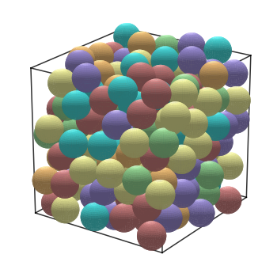
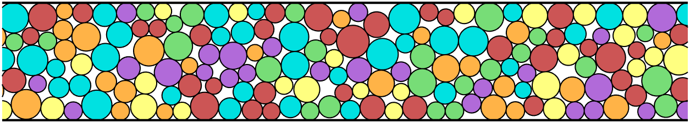
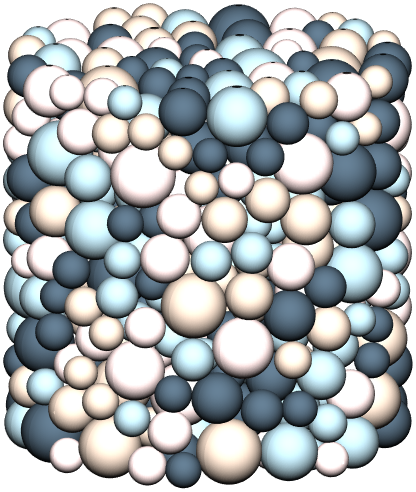
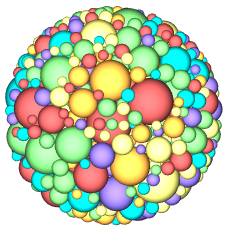

# Densely Packing Spheres in Python - Random Close Packing (RCP)

## The Problem of High-Density Packing
Generating **True Random Close Packing** is fundamentally more complex than simple random placement. At low densities, "place and reject" (Monte Carlo) methods are sufficient. However, as the system approaches the jamming limit (volume fraction $\phi \approx 0.64$ for monodisperse spheres), the probability of placing a sphere without overlap drops toward zero.

To generate dense packings, the system must **evolve** toward a jammed state using either optimization methods or dynamical simulations.

## Implementation with `rcpgenerator`

`rcpgenerator` is an open-source Python library developed to generate dense, jammed packings of non-overlapping spheres. Unlike simple rejection-sampling methods that fail at high volume fractions, this toolkit uses an **optimization-based "inflation" approach** to reach the **Random Close Packing (RCP) limit** ($\phi \approx 0.64$).

* **GitHub Repository:** [rcpgenerator: Fast Spehere Packing Generating](https://colab.research.google.com/github/KD-physics/RCPGenerator/blob/main/getting_started.ipynb)
* **Key Features:** Support for polydisperse distributions, custom container geometries (box, cylinder, sphere), and higher dimensions (tested up to 7).
* [Run in Colab ↗](https://colab.research.google.com/github/KD-physics/RCPGenerator/blob/main/getting_started.ipynb)

### Quick Start
```python
from rcpgenerator import Packing

# Initialize 200 spheres in a unit cube
p = Packing(N=200, Ndim=3, box=[1,1,1]) # See colab getting_started for more examples and settings

# Evolve the system toward a jammed configuration
final_packing = p.pack()

# Visualize the final packing
p.show_packing() # should only take a few seconds to run

# Display Packing
p.show_packing(figsize=(4,4)) # could take 10's of seconds to run
```



## Examples of Packings

|  |  |  |  |
|:---------------------------:|:---------------------------:|:---------------------------:|:---------------------------:|
| Cropped dense rcp 2D packing; periodic boundary in x, hard boundary in y, and constrained height to be fixed multiple of largest diameter. | Dense 2D disk packing confined within circular container                  | Cylindrically confined packing of 3D spherical particles with upper and lower hard boundaries.                   | 3D packing of hard spheres, confined to a spherical container.                  |


## Methodology Comparison

Two common approaches are used in the literature to create such packings.

### 1. Optimization-based packing algorithms
These methods allow particles to slightly overlap during the optimization process.

The idea is:
- Start from a random low-density configuration.
- Gradually increase particle diameters.
- Use an optimizer to adjust particle positions to minimize overlaps.
- Stop when overlaps fall below a small tolerance.

In well-converged packings, overlaps are typically extremely small (often ~10⁻³ of the particle diameter or less).

The position updates can follow either:
- physics-inspired force updates, or
- purely mathematical optimization methods.

### 2. Dynamical hard-sphere simulations
Another class of algorithms simulates true hard spheres colliding like billiard balls.

In these algorithms:
- A gas of spheres starts at low density with high kinetic energy
- Particle diameters are slowly increased
- Energy is gradually removed from the system
- The system evolves through collisions until particles become jammed

These methods follow physically realistic particle dynamics and have been widely used to study hard-sphere systems.

---

## Links to other solutions

### Optimization & Geometric Methods
These methods primarily use energy minimization, force-biased algorithms, or geometric inflation. They are often highly efficient for reaching static jammed states but may skip the intermediate physics of a settling system.

| Package | Functionality | Language | Specialization | Difficulty | Link |
| :--- | :--- | :--- | :--- | :--- | :--- |
| **RCP Gen** | Fast generator for arbitrary dimensions (ND). (MATLAB version of this code) | MATLAB | Made for RCP | Easy | [FileEx](https://www.mathworks.com/matlabcentral/fileexchange/181165-random-close-packing-generator-in-arbitrary-dimensions) |
| **Circle Dist** | Solve charge distribution problem that creates rcp | MATLAB | Made for Packing | Easy but slow | [FileEx](https://www.mathworks.com/matlabcentral/fileexchange/56601-random-close-packing-rcp-on-arbitrary-distribution-of-circle-sizes) |
| **Pack-spheres** | Brute-force/stochastic circle and sphere packing. | JavaScript | Configurable | Easy | [GitHub](https://github.com/mattdesl/pack-spheres) |
| **Pyspherepack** | Quick-and-dirty gradient-based optimization using Autograd. | Python | Made for Packing | Easy | [GitHub](https://github.com/cunni/pyspherepack) |

---

### Dynamical & Physical Simulation Methods
These use Molecular Dynamics (MD), Discrete Element Method (DEM), or event-driven simulations. They provide high epistemic stability for studying physical packing kinetics and non-spherical geometries.

| Package | Functionality | Language | Specialization | Difficulty | Link |
| :--- | :--- | :--- | :--- | :--- | :--- |
| **VasiliBaranov/PackingGen** | Comprehensive suite for LS, Jodrey-Tory, and Force-Biased. | C++ | Made for RCP | Moderate | [GitHub](https://github.com/VasiliBaranov/packing-generation) |
| **ParticlePack** | DEM-based shaking/shuffling for spherical and irregular grains. | C# / Unity | Made for Packing & Goes Beyond Spheres to Other Shapes | High | [GitHub](https://github.com/MosGeo/ParticlePack) |
| **LAMMPS** | Massive-scale MD for granular systems and hard-spheres. | C++ / Python | Configurable | High | [Website](https://www.lammps.org/) |
| **YADE** | DEM simulatpr | C++ / Python | Configurable | High | [Website]([https://www.lammps.org/](https://yade-dem.org/doc/yade.pack.html)) |
| **HOOMD-blue** | GPU-accelerated MD/HPMC for hard particles and shapes. | Python / C++ | Configurable | Moderate | [GitHub](https://github.com/glotzerlab/hoomd-blue) |

## Practical Considerations

Physics-based updates typically involve an associated step size (typically a time step) that must remain relatively small for numerical stability, and slow dramatically for highly polydisperse packings where the largest-to-smallest particle size ratio is large. Optimization methods, on the other hand, can take larger non-physical steps toward the minimum overlap configuration and tend to be more stable in highly polydisperse cases.

Because of this, optimization approaches often reach dense packings more quickly (allowing one to generate packings of 1000+ particle in seconds to minutes), although the intermediate states do not correspond to a physically realistic trajectory. In practice, structural properties of packings generated by optimization algorithms tend to agree well with physical experiments (packing fraction, structure factor, coordination number, etc).

rcpgenerator uses an optimization-based approach (ADAM optimizer) to separate particles as they grow in size.


---
