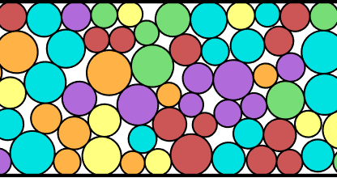
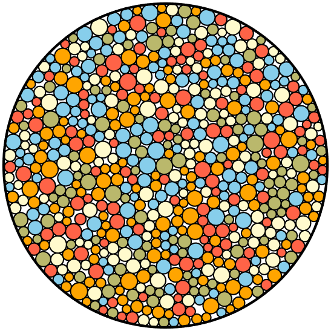
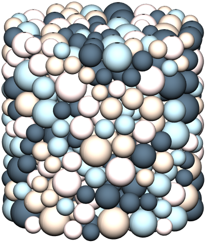

# N‑Dimensional Random Close Packing Generator


## Description

ND‑RCP provides fast, flexible tools for generating and relaxing random close packings of spheres in arbitrary dimensions.
- **C++** executables for seeding and optimizing packings with ADAM/Verlet.
- **MATLAB** scripts for initialization, packing, and visualization.

Ideal for computational physicists, ML researchers, and anyone needing dense particle packings for simulations or 3D printing.

|  |  |  |  |
|:---------------------------:|:---------------------------:|:---------------------------:|:---------------------------:|
| Caption 1                   | Caption 2                   | Caption 3                   | Caption 4                   |


## Features

- Generates random close packings via ADAM optimizer
- Built-in support for a wide variety of particle size distributions
- Periodic or hard‑walled boundary conditions, including circular or hypersphere walls
- Packings hieight can be constrained to multiple of largest particle diameter
- Export/import plain‑text packing files
- Both c++ and MATLAB routines included

## Repository Structure

/c++

    ├ RCPGenerator.cpp         # packing relaxation executable
    └ InitializeParticles.cpp  # initial‐positions generator

/matlab

    ├ initialize\_particlesND.m # N‑D seeding function
    ├ CreatePacking.m          # packing optimizer
    ├ plot\_particles\_periodic.m
    ├ plot\_particles\_3D.m
    └ example.m                # end‑to‑end demo

README.md

LICENSE


## Prerequisites

- **C++**: GCC or Clang supporting C++17
- **MATLAB**: R2022a or later

## Build & Installation

```bash
cd c++
g++ -O3 -std=c++17 -o InitializeParticles.exe InitializeParticles.cpp
g++ -O3 -std=c++17 -o RCPGenerator.exe       RCPGenerator.cpp
````

*No installation step required for the MATLAB scripts.*

## Usage: C++

### 1. Intializing Particle Positions and Diameters

First, particle positions and diameter need to be generated in a column form x, y, z, ..., D. One can do this themselves or used the provide InitializeParticles.cpp function. There is no upper limit on dimensions, only lower limit on 2 dimensions. Note that the positions can be saved to a file and later uploaded using the --file flag in RCPGenerator, or then can be piped into RCPGenerator via | or <. An example use case for InitializeParticles.cpp would be (assuming compiled to InitializeParticles.exe)

```bash
./InitializeParticles.exe \
  --N 500 \
  --Ndim 3 \
  --phi 0.64 \
  --dist monodisperse \
  --D 1.0 \
  --box 1,1,1 \
  > init_500_3D.txt
```

The command line arguments are as follows

### Command‑line Arguments (C++)

| Flag            | Type       | Default         | Description                                                                                                        |
| --------------- | ---------- | --------------- | ------------------------------------------------------------------------------------------------------------------ |
| `--phi`         | float      | 0.05            | Target packing fraction                                                                                            |
| `--N`           | int        | —               | Number of particles                                                                                                |
| `--Ndim`        | int        | —               | Spatial dimensions (>=2)                                                                                           |
| `--box`         | comma list | 1 repeated Ndim | Box lengths per dimension                                                                                          |
| `--dist`        | string     | —               | Distribution type: mono, bidisperse, gaussian, biGaussian, lognormal, flat, powerlaw, exponential, weibull, custom |
| `--d`           | float      | —               | Diameter (monodisperse)                                                                                            |
| `--d1`          | float      | —               | First diameter (bidisperse)                                                                                        |
| `--d2`          | float      | —               | Second diameter (bidisperse)                                                                                       |
| `--p`           | float      | —               | Fraction (bidisperse, biGaussian)                                                                                  |
| `--mu`          | float      | —               | Mean (gaussian)                                                                                                    |
| `--sigma`       | float      | —               | Std dev (gaussian)                                                                                                 |
| `--mu1`         | float      | —               | Mean1 (biGaussian)                                                                                                 |
| `--sigma1`      | float      | —               | Std1 (biGaussian)                                                                                                  |
| `--mu2`         | float      | —               | Mean2 (biGaussian)                                                                                                 |
| `--sigma2`      | float      | —               | Std2 (biGaussian)                                                                                                  |
| `--d_min`       | float      | —               | Min diameter (flat, powerlaw, exponential)                                                                         |
| `--d_max`       | float      | —               | Max diameter (flat, powerlaw, exponential)                                                                         |
| `--exponent`    | float      | —               | Exponent (powerlaw)                                                                                                |
| `--scale`       | float      | —               | Scale (weibull)                                                                                                    |
| `--shape`       | float      | —               | Shape (weibull)                                                                                                    |
| `--custom_list` | string     | —               | Comma-separated list for custom distribution                                                                       |
| `--fix-height`  | flag       | false           | Fix height dimension when scaling diameters                                                                        |
| `--help`        | flag       | false           | Show help message                                                                                                  |


### 2. Generating RCP (C++)

Using a set of initial positions and diameters provide via column format x,y,z,...D, either piped in or set via the --file flag, and RCP can be generated simply as 

```bash
./RCPGenerator.exe --file init_500_3D.txt
```

where the boundaries are all periodic, and the number of dimensions of particles are inferred from data within the file. With this format the final positions will be printed to the command terminal. If one desires the positions to be printed to a file, the the use case would be

```bash
./RCPGenerator.exe --file init_500_3D.txt --output saved_positions
```

or

```bash
./RCPGenerator.exe --file init_500_3D.txt > saved_positions.txt
```

where .txt is always attached to end of file name automatically. There are many other flags to set the size of the container (box), to make the boundaries hard (walls), to print status updates (verbose), if the final height of the container is to be a multiple of the first listed diameter (fix-height). A full list of options are given below. A more controlled use might be something like 

```bash
./InitializeParticles.exe --N 15000 --Ndim 3 --dist powerlaw --d_min 1.0 --d_max 15.0 --exponent -3 --phi 0.01 --box 1,0.5,1 --walls 0,1,0 > input.txt
./RCPGenerator.exe --file input.txt --output final_packing.txt --NeighborMax 1500 --box 1,0.5,1 --walls 0,1,0 
```

In this example, we have the following attributes

   N (Number of particles)          : 15,000

   Ndim (dimensions)                : 3
   
   Diameter distribution (--dist)   : Power law with exponent -3 and the lower and upper limits from 1-15
   
   Packing fraction (phi)           : 0.01
   
   Container is box of widths (box) : 1 along x, 0.5 along y, and 1 along z
   
   Boundary conditions (walls)      : 0 (false) means periodic in x, 1 (true) means hard wall in y, 0 (false) means periodic in z
   
   NeighborMax                      : This one is a little tricky. The code works by building a maintaining a full list of possible nearby neighbors that gets updated periodically. The matrix that stores these possible neighbors is pre-assigned an allocation of memory based on the max number of expected neighbor neighbors. There are default values for NeighborMax but they might not be enough. If it isn't the code will exit and tell you to increase this number. As the size ratio between large and small particles grows, the number of possible nearby neighbors will as well
   
Full list of options

| Flag              | Type       | Default          | Description                                                     |
| ----------------- | ---------- | ---------------- | --------------------------------------------------------------- |
| `--file`          | string     | —                | Input file (output of InitializeParticles.exe)                  |
| `--output`        | string     | packing\_out.txt | Output file for relaxed packing                                 |
| `--box`           | comma list | —                | Box lengths per dimension                                       |
| `--NeighborMax`   | int        | 0 (auto)         | Max neighbors for spatial binning (0 = automatic based on Ndim) |
| `--seed`          | int        | 0                | Seed for RNG (0 = time-based)                                   |
| `--verbose`       | flag       | false            | Print progress and debug messages                               |
| `--fix-height`    | flag       | false            | Fix height dimension when scaling diameters                     |
| `--save-interval` | int        | 0                | Interval (steps) to save intermediate packings (0 = off)        |
| `--walls`         | comma list | 0 repeated Ndim  | Hard-wall flags per dimension (0 = periodic, 1 = hard wall)     |


### 3. How to properly use fixed height

### 4. How to use circular boundary

##. MATLAB

Matlab functionality is one-to-one with c++ code. There is the example file example.m that include end to end demos

## Rough Overview of Algorithm

RCPGenerator implements an iterative expansion–relaxation scheme first described by Desmond & Weeks (2009) [arXiv:0903.0864]. Starting from an initial set of particle positions and diameters, the algorithm alternates between expanding particle sizes and minimizing the overlap energy. When the force can be sufficiently balanced, but the overlap energy cannot be reduced below a threshold, diameters are contracted and the minimization repeats. Expansion and contraction rates decrease over time until the diameter adjustment step falls below a tolerance, at which point the algorithm terminates and returns the final positions and diameters as the RCP state.

Energy minimization was originally implemented using a conjugate‑gradient solver in Desmond & Weeks (2009). Since then the ADAM optimizer was introduced for neural netork training, and here we find it performs much faster. As such, energy minimization is handled by a sequence of optimizers: ADAM for rapid initial convergence, AMSGrad for stability when ADAM stalls, and finally overdamped Verlet integrator if overlaps persist. In practice, ADAM quickly removes most overlaps (down to ≈5×10⁻⁴ D), after which AMSGrad and Verlet address the remaining small overlaps (down to ≈1×10⁻⁵ D).

1. **Initialization**

   * Load initial positions `x` and diameters `D` from input.
   * Set constants:

     * `DELTA_PHI0 = 1.5 × 1.5e-3` (initial φ step size)
     * `phi_min` (dimension‐dependent minimum φ)
     * `N_STEPS = 150000`, `DT = 0.1`, default `METHOD = "ADAM"`
   * Initialize optimizer state (ADAM/AMSGrad/Verlet), neighbor lists, and force arrays.

2. **Main Loop (up to `N_STEPS`)**

   * **Force evaluation & neighbor management**

     * Recompute neighbor pairs every 750 steps or when particle displacements exceed a quarter of the minimum diameter.
     * Compute forces `F`, potential energy `U`, and minimum gap distances via `GetForcesND_3`.
   * **Optimizer switching**

     * **ADAM** for steps 1–2500 → switch to **AMSGrad** for steps 2501–4000 → switch to **Verlet** thereafter.
     * Triggers at:

       * step > 2500: `method = "AMSGrad"`
       * step > 4000: `method = "Verlet"`
   * **Diameter scaling**

     * On step 150, set `delta_phi = DELTA_PHI0`.
     * Update `phi = max(phi + dphi, phi_min)`.
     * Compute and apply new diameters via `scale_diametersND` (and scale box height if `--fix-height`).
   * **Expansion vs. contraction**

     * If `U < U_threshold` (≈6.25×10⁻⁸) or `max_min_dist < sqrt(U_threshold)×10`, **expand**: `dphi = delta_phi`.
     * Else if `U > U_threshold` and `step > 125`:

       * If net force magnitude < `F_tol` (≈5×10⁻⁶), **contract**: `dphi = −delta_phi/2`.
       * Otherwise hold: `dphi = 0`.
     * Adjust `delta_phi` up/down based on oscillations or sustained progress.
   * **Position updates**

     * For ADAM/AMSGrad: standard ADAM updates using `m_hat`, `v_hat`, and learning rate `alpha`.
     * For Verlet: `x += v_verlet×DT + 0.5×a_old×DT²`.
   * **Termination**

     * Break when `delta_phi < 5e-6` and overlaps/forces are below thresholds.

3. **Output**

   * Save intermediate packings if `--save-interval > 0`.
   * On termination, write final positions + diameters to `--output`.

This loop alternates expansion when overlaps are low and contraction when overlaps are too large, steadily honing in on a tight random close packing.


## Contributing

1. Fork the repo
2. Create a feature branch
3. Submit a pull request
4. Address review feedback

## License & Citation

This project is released under the **MIT License**.

* Desmond, K. W., & Weeks, E. R. (2014). *Influence of particle size distribution on random close packing of spheres*. Physical Review E, 90(2), 022204. [arXiv:1303.4627](https://arxiv.org/pdf/1303.4627)
* Desmond, K. W., & Weeks, E. R. (2009). *Random close packing of disks and spheres in confined geometries*. Physical Review E, 80(5), 051305. [arXiv:0903.0864](https://arxiv.org/pdf/0903.0864)

## Contact

Kenneth Desmond — [@<KD-physics>](https://github.com/<KD-physics>)

```
```
