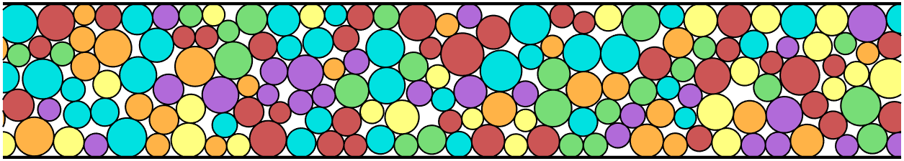
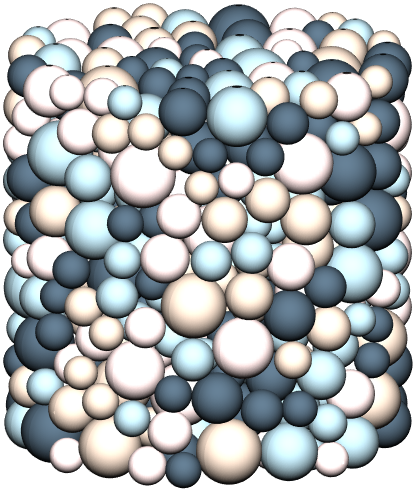
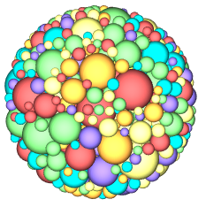
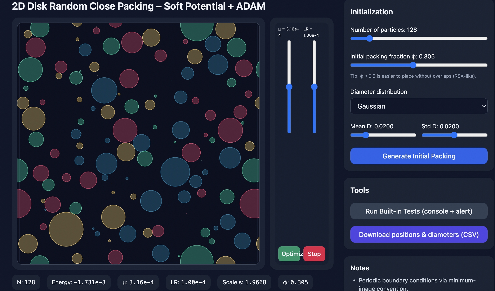

[🏠 Kenneth Desmond](https://kd-physics.github.io/)

# RCPGenerator: N-dimensional random close packing


RCPGenerator is an open-source Python package for generating dense, disordered
packings of polydisperse particles. It supports 2D disks, 3D spheres, and
higher-dimensional hyperspheres with periodic boundaries, hard walls, and curved
containers including circles, cylinders, and spheres.

The maintained implementation is the `rcpgenerator` Python package. Its numerical
engine is current C++ code compiled into a Python extension with pybind11 and OpenMP;
it is not the standalone C++ program preserved in `legacy/`. The repository also
contains the `rcptools` analysis and search toolkit, worked examples, a Getting
Started notebook, and an interactive packing viewer.

RCPGenerator is intended for computational studies of random close packing, sphere
packing, granular materials, colloids, dense particle systems, powders, confinement,
and particle-size-distribution effects. The current implementation supports prescribed
or generated diameter distributions and is designed for systems with high
polydispersity and large particle counts.

Project resources:

- [Python package documentation](https://github.com/KD-physics/RCPGenerator/blob/main/python_code/python/README.md)
- [Getting Started notebook](https://github.com/KD-physics/RCPGenerator/blob/main/getting_started.ipynb)
- [Python examples](https://github.com/KD-physics/RCPGenerator/tree/main/python_code/python/examples)
- [Interactive packing viewer](https://kd-physics.github.io/RCPGenerator/webapp/index.html)
- [Issue tracker](https://github.com/KD-physics/RCPGenerator/issues)
- [RCPGenerator manuscript](https://arxiv.org/abs/2608.12235)

## Install the current Python package

Until the wheels are published on PyPI, install the maintained package from this
repository.

In a terminal:

```bash
git clone https://github.com/KD-physics/RCPGenerator.git
cd RCPGenerator/python_code/python
python -m pip install -v .
```

In Google Colab or a Jupyter notebook:

```python
!git clone https://github.com/KD-physics/RCPGenerator.git
%cd RCPGenerator/python_code/python
!python -m pip install -v .
```

Source installation compiles the extension and therefore requires suitable build
tools. Once the platform wheels are published, `pip install rcpgenerator` will be the
primary installation method and will not require a local compiler or separately
configured OpenMP installation.

## Python quickstart

```python
from rcpgenerator import Packing

packing = Packing(
    phi=0.08,
    N=200,
    Ndim=3,
    box=[1.0, 1.0, 1.0],
    walls=[0, 0, 0],  # 0 = periodic; 1 = hard wall
    dist={"type": "mono", "d": 1.0},
    neighbor_max=0,
    seed=123,
)

result = packing.pack()
print("final packing fraction:", packing.phi_final)
print("completed steps:", packing.steps)

# In an interactive Python session:
packing.show_packing(figsize=(4, 4))
```

This is the principal workflow: construct a `Packing`, call `pack()`, and inspect the
object or returned result dictionary. See the
[Python package README](https://github.com/KD-physics/RCPGenerator/blob/main/python_code/python/README.md)
for boundary syntax, distributions, wheel support, source-build options, `rcptools`,
viewer-bundle export, interpretation guidance, and the complete public API.

## Capabilities

- 2D disk, 3D sphere, and N-dimensional hypersphere packings
- Monodisperse, bidisperse, continuous, power-law, and custom diameter distributions
- Periodic and hard-wall boundary conditions, independently selectable by dimension
- Rectangular boxes and curved disk, cylinder, sphere, or hypersphere confinement
- Optional fixed-height containers
- Seeded particle initialization
- Multithreaded C++/OpenMP numerical core exposed through Python
- Packing histories and diagnostics for analysis and validation
- Companion `rcptools` search, persistence, analysis, and viewer-bundle utilities
- 2D rendering, 3D rendering, and an interactive browser-based packing viewer

## Example packings

|  |  |  |  |
|:---:|:---:|:---:|:---:|
| Dense 2D packing with periodic and hard-wall boundaries | Dense 2D disks in a circular container | 3D spheres with cylindrical confinement | 3D spheres with spherical confinement |

## Interactive packing viewer

[Open the hosted RCP packing viewer](https://kd-physics.github.io/RCPGenerator/webapp/index.html)



The viewer supports direct inspection of 2D packings and cross-sectional inspection of
3D packings, with pan, zoom, slicing, coloring, overlays, and field-of-view statistics.
The installed `rcptools.bridge.write_bundle` function exports the `manifest.json`,
`pos.f32`, and `dia.f32` bundle files accepted by the viewer. Viewer development files
are available in [`webapp/`](https://github.com/KD-physics/RCPGenerator/tree/main/webapp)
and in the Python project source.

## Boundaries and containers

In the Python API, `box` supplies the size of each dimension and `walls` describes its
boundaries:

- `0` selects a periodic boundary.
- `1` selects a hard wall.
- A negative first value `-t` selects one hyperspherical hard boundary over the first
  `t` dimensions. For example, `-2` produces a disk in 2D or a cylindrical
  cross-section in 3D, while `-3` produces a sphere in 3D.
- `fix_height=True` makes the final box dimension a fixed multiple of the first
  particle diameter.

See the [current examples](https://github.com/KD-physics/RCPGenerator/tree/main/python_code/python/examples)
for box, circular, cylindrical, spherical, bidisperse, polydisperse, and staged
packing-fraction cases.

## Repository structure

```text
python_code/python/   maintained Python package and current C++/pybind11 engine
webapp/               hosted interactive viewer
legacy/c++/           earlier standalone C++ implementation
legacy/matlab/        earlier MATLAB implementation
Images/               README and documentation images
getting_started.ipynb repository-level Getting Started notebook
```

The current Python wheel is built from `python_code/python/src/core/` and
`python_code/python/src/bindings/`. Nothing under `legacy/` is compiled into the Python
package.

## Legacy standalone implementations

The project began as MATLAB code, was converted to a standalone C++ program, and was
then adapted into Python. Continued development in the Python package changed the
convergence logic, μ scheduling, neighbor handling, diagnostics, and public interface.

The standalone C++ and MATLAB implementations under `legacy/` remain available and
functional, but they represent the earlier algorithm. They do not implement the version
of the algorithm described in the RCPGenerator manuscript. They should not be expected
to follow the same numerical trajectory, convergence behavior, scheduler, output
contract, or API as the maintained Python package.

### Legacy C++ interface

The standalone C++ workflow uses two programs:

- `InitializeParticles.cpp` generates initial positions and diameters.
- `RCPGenerator.cpp` reads those particles and performs the earlier relaxation
  procedure.

Build them from the legacy directory with a C++17 compiler:

```bash
cd legacy/c++
g++ -O3 -std=c++17 -o InitializeParticles InitializeParticles.cpp
g++ -O3 -std=c++17 -o RCPGenerator RCPGenerator.cpp
```

Initialize a periodic 3D monodisperse system:

```bash
./InitializeParticles \
  --N 500 \
  --Ndim 3 \
  --phi 0.05 \
  --dist mono \
  --d 1.0 \
  --box 1,1,1 \
  --walls 0,0,0 \
  > init_500_3D.txt
```

Run the standalone packer:

```bash
./RCPGenerator \
  --file init_500_3D.txt \
  --output packing_500_3D \
  --box 1,1,1 \
  --walls 0,0,0
```

Important legacy initializer options include `--N`, `--Ndim`, `--phi`, `--box`,
`--walls`, `--dist`, distribution-specific parameters such as `--d`, `--d_min`,
`--d_max`, or `--exponent`, and `--fix_height`. Important legacy packer options include
`--file`, `--output`, `--box`, `--walls`, `--NeighborMax`, `--fix-height`, and
`--save-interval`.

These commands document the standalone legacy executables only. For new Python work,
use `rcpgenerator.Packing` and the maintained package documentation.

### Legacy MATLAB interface

The MATLAB implementation is under `legacy/matlab/`. A typical earlier workflow is:

```matlab
[x0, D0] = initialize_particlesND(phi, N, Box, distribution);
plot_particles_periodic(x0, D0, Box)

[x, D, U_history, phi_history, Fx] = ...
    CreatePacking(x0, D0, Box, walls, fix_height, verbose);

plot_particles_periodic(x, D, Box)
```

See `legacy/matlab/example.m` for the complete legacy MATLAB example. As with the
standalone C++ program, this code uses the earlier convergence and μ-scheduling logic
and is retained for historical use and reproducibility.

## Method, interpretation, and citation

RCPGenerator uses an iterative inflation–relaxation approach. The maintained Python
implementation and its large-size-ratio results are described in the RCPGenerator
manuscript. Packing is a numerical procedure whose convergence and runtime depend on
the particle distribution, initial state, dimensions, boundaries, and run settings;
validate the returned diagnostics for the intended scientific application.

Preferred citation:

- Desmond, K. “Random close packing at extreme size ratios with an Adam-based
  inflation protocol.” arXiv:2608.12235 (2026).
  [arXiv:2608.12235](https://arxiv.org/abs/2608.12235)

Method background:

- Desmond, K. W. and Weeks, E. R. “Random close packing of disks and spheres in
  confined geometries.” *Physical Review E* **80**, 051305 (2009).
  [arXiv:0903.0864](https://arxiv.org/abs/0903.0864)
- Desmond, K. W. and Weeks, E. R. “Influence of particle size distribution on random
  close packing of spheres.” *Physical Review E* **90**, 022204 (2014).
  [arXiv:1303.4627](https://arxiv.org/abs/1303.4627)
- Clarke, A. S. and Wiley, J. D. “Numerical simulation of the dense random packing of
  a binary mixture of hard spheres: Amorphous metals.” *Physical Review B* **35**,
  7350 (1987).

## License and contact

The maintained Python distribution is released under the
[MIT License](https://github.com/KD-physics/RCPGenerator/blob/main/python_code/python/LICENSE).

Questions and bug reports are welcome through the
[GitHub issue tracker](https://github.com/KD-physics/RCPGenerator/issues).

Kenneth Desmond — [KD-physics on GitHub](https://github.com/KD-physics)
