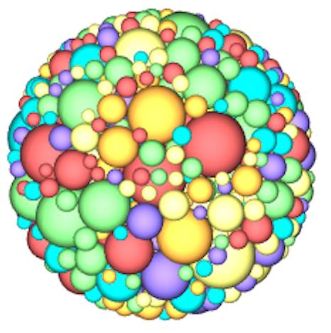

# N‑Dimensional Random Close Packing Generator


## Description

RCPGenerator provides a fast, flexible tool for generating random close packings of hyperspheres in arbitrary dimensions.
- **C++** executables for seeding and optimizing packings with ADAM/Verlet.
- **MATLAB** for seeding and optimizing packings with ADAM/Verlet and scripts for visualization.

Ideal for computational physicists, ML researchers, and anyone needing dense particle packings for simulations or 3D printing.

|  |  |  |  |
|:---------------------------:|:---------------------------:|:---------------------------:|:---------------------------:|
| Cropped 2D packing with periodic boundary in the x-direction and hard boundary in the y-direction. A constraint is applied to ensure the final packing height is a user-specified multiple of the largest particle diameter. | Circle confined packing                  | Cylindrically confined packing with upper and lower hard boundaries.                   | Spherically confined packing.                  |


## Features

- Generate packings via an iterative expansion–contraction scheme (Desmond & Weeks 2009).
- Support for various particle size distributions (monodisperse, bidisperse, Gaussian, power‑law, custom, and more).
- Periodic or hard‑wall boundary conditions (including circular, cylindrical, or spherical containers).
- Optionally fix container height as a multiple of the first particle diameter.
- If computer resources are sufficient, can generate packings in any arbitrary dimension of size 2 or greater
- Export and import packing data in plain‑text format.
- Both C++ and MATLAB routines included. Each set of code are independent whose functionality mirror each other. 

## Repository Structure

/c++

    ├ RCPGenerator.cpp         # Generates packings via ADAM optimerizer
    └ InitializeParticles.cpp  # Initial position and diameter generator

/matlab

    ├ initialize\_particlesND.m # Initial position and diameter generator
    ├ CreatePacking.m          # Generates packings via ADAM optimerizer
    ├ plot\_particles\_periodic.m
    ├ plot\_particles\_3D.m
    └ example.m                # end‑to‑end demo

README.md

LICENSE


## Prerequisites

- **C++**: GCC or Clang supporting C++17
- **MATLAB**: R2022a or later

## Build & Installation

```bash
cd c++
g++ -O3 -std=c++17 -o InitializeParticles.exe InitializeParticles.cpp
g++ -O3 -std=c++17 -o RCPGenerator.exe       RCPGenerator.cpp
````

*No installation step required for the MATLAB scripts.*

## Usage: C++

### 1. Intializing Particle Positions and Diameters

First, particle positions and diameters must be generated in column format as x, y, z, ..., D, where D is the diameter. You can create this data manually or use the provided InitializeParticles.cpp utility. There is no upper limit on the number of dimensions, though the minimum is 2D.

The generated positions can be saved to a file and later loaded into RCPGenerator using the --file flag, or piped directly via | or <.

An example use case for InitializeParticles.cpp is:

```bash
./InitializeParticles.exe \
  --N 500 \
  --Ndim 3 \
  --phi 0.05 \
  --dist monodisperse \
  --D 1.0 \
  --box 1,1,1 \
  > init_500_3D.txt
```

This example would generate a intial packing of 500 particles in 3 dimensions at packing fraction 5%. The container size is 1 x 1 x 1, and all the diameters are equal in size. The positions and diameters are saved to init_500_3D.txt.

Below is the full set of InitializeParticles.exe flags to adjust the type of packing that is initialized.

#### Command‑line Arguments for InitializeParticles (C++)

| Flag            | Type       | Default         | Description                                                                                                        |
| --------------- | ---------- | --------------- | ------------------------------------------------------------------------------------------------------------------ |
| `--phi`         | float      | 0.05            | Target packing fraction                                                                                            |
| `--N`           | int        | —               | Number of particles                                                                                                |
| `--Ndim`        | int        | —               | Spatial dimensions (>=2)                                                                                           |
| `--box`         | comma list | 1 repeated Ndim | Box lengths per dimension                                                                                          |
| `--dist`        | string     | —               | Distribution type: mono, bidisperse, gaussian, biGaussian, lognormal, flat, powerlaw, exponential, weibull, custom |
| `--d`           | float      | —               | Diameter (monodisperse)                                                                                            |
| `--d1`          | float      | —               | First diameter (bidisperse)                                                                                        |
| `--d2`          | float      | —               | Second diameter (bidisperse)                                                                                       |
| `--p`           | float      | —               | Fraction (bidisperse, biGaussian)                                                                                  |
| `--mu`          | float      | —               | Mean (gaussian)                                                                                                    |
| `--sigma`       | float      | —               | Std dev (gaussian)                                                                                                 |
| `--mu1`         | float      | —               | Mean1 (biGaussian)                                                                                                 |
| `--sigma1`      | float      | —               | Std1 (biGaussian)                                                                                                  |
| `--mu2`         | float      | —               | Mean2 (biGaussian)                                                                                                 |
| `--sigma2`      | float      | —               | Std2 (biGaussian)                                                                                                  |
| `--d_min`       | float      | —               | Min diameter (flat, powerlaw, exponential)                                                                         |
| `--d_max`       | float      | —               | Max diameter (flat, powerlaw, exponential)                                                                         |
| `--exponent`    | float      | —               | Exponent (powerlaw)                                                                                                |
| `--scale`       | float      | —               | Scale (weibull)                                                                                                    |
| `--shape`       | float      | —               | Shape (weibull)                                                                                                    |
| `--custom_list` | string     | —               | Comma-separated list for custom distribution                                                                       |
| `--fix-height`  | flag       | false           | Fix height dimension when scaling diameters                                                                        |
| `--help`        | flag       | false           | Show help message                                                                                                  |


### 2. Generating RCP (C++)

RCPGenerator requires a set of initial particle positions and diameters provided in column format as x, y, z, ..., D. This data can be piped in or loaded using the --file flag. A simple example is:

```bash
./RCPGenerator.exe --file init_500_3D.txt
```

This command uses all default settings: periodic boundaries in all directions, unit-sized container, and automatic inference of the number of dimensions and particles from the input data.

By default, the final packed positions will be printed to the terminal. To save the output to a file, you can use the --output flag, for example:

```bash
./RCPGenerator.exe --file init_500_3D.txt --output saved_positions
```

Alternatively, output can be redirected manually:

```bash
./RCPGenerator.exe --file init_500_3D.txt > saved_positions.txt
```

Note that .txt is automatically appended to the output filename when using the --output flag.

There are many additional flags available to customize the packing process, including:

   --box to set the container size,

   --walls to specify hard or periodic boundaries,

   --verbose to print status updates during packing,

   --fix-height to constrain the final packing height to be a user-defined multiple of the largest particle diameter.

```bash
./InitializeParticles.exe --N 15000 --Ndim 3 --dist powerlaw --d_min 1.0 --d_max 15.0 --exponent -3 --phi 0.01 --box 1,0.5,1 > input.txt
./RCPGenerator.exe --file input.txt --output final_packing.txt --NeighborMax 1500 --box 1,0.5,1 --walls 0,1,0 
```

In this example, the packing would have the following attributes

   - **Number of particles (--N)**         : 15,000

   - **Number of dimensions (--Ndim)**                : 3
   
   - **Diameter distribution (--dist)**   : Power law with exponent -3 and the lower and upper limits from 1-15
   
   - **Packing fraction (--phi)**           : 0.01
   
   - **Container is box of widths (--box)** : 1 along x, 0.5 along y, and 1 along z
   
   - **Boundary conditions (--walls)**      : 0 (false) means periodic in x, 1 (true) means hard wall in y, 0 (false) means periodic in z
   
   - **--NeighborMax**                      : This one is a little tricky. The code works by building a maintaining a full list of possible nearby neighbors that gets updated periodically. The matrix that stores these possible neighbors is pre-assigned an allocation of memory based on the max number of expected neighbor neighbors. There are default values for NeighborMax but they might not be enough. If it isn't the code will exit and tell you to increase this number. As the size ratio between large and small particles grows, the number of possible nearby neighbors will as well
   
Full list of options

| Flag              | Type       | Default          | Description                                                     |
| ----------------- | ---------- | ---------------- | --------------------------------------------------------------- |
| `--file`          | string     | —                | Input file (output of InitializeParticles.exe)                  |
| `--output`        | string     | packing\_out.txt | Output file for relaxed packing                                 |
| `--box`           | comma list | —                | Box lengths per dimension                                       |
| `--NeighborMax`   | int        | 0 (auto)         | Max neighbors for spatial binning (0 = automatic based on Ndim) |
| `--seed`          | int        | 0                | Seed for RNG (0 = time-based)                                   |
| `--verbose`       | flag       | false            | Print progress and debug messages                               |
| `--fix-height`    | flag       | false            | Fix height dimension when scaling diameters                     |
| `--save-interval` | int        | 0                | Interval (steps) to save intermediate packings (0 = off)        |
| `--walls`         | comma list | 0 repeated Ndim  | Hard-wall flags per dimension (0 = periodic, 1 = hard wall)     |
| `--MaxSteps`      | int        | 150000           | **Still Need to Implement** MaxSteps before it terminates without finishing                 |


### 3. How to properly use fixed height

When using the `--fix-height` flag, both `InitializeParticles.exe` and `RCPGenerator.exe` must be given the same `--box` setting. In this mode, the last value in `--box` is interpreted as the desired container height in units of the **first** particle’s diameter. Internally, the workflow proceeds as follows:

1. **Initialization (`InitializeParticles.exe`)**

   * You supply `--box x,y,...,w` and `--fix-height`.
   * The last component `w` is treated as a multiple of the first particle diameter.
   * The program rescales all particle diameters and sets the actual container height to `w × D₁`, where `D₁` is the first particle diameter in your generated list, while preserving the target packing fraction.

2. **Relaxation (`RCPGenerator.exe`)**

   * You supply the same `--box x,y,...,w` and `--fix-height` flags.
   * Again, the last `w` is taken relative to the stored first particle diameter.
   * During expansion–relaxation, the container height is held at `w × D₁` as particles expand or contract to meet the packing fraction.

```bash
./InitializeParticles.exe --N 15000 --Ndim 3 --dist powerlaw --d_min 1.0 --d_max 15.0 --exponent -3 --phi 0.01 --box 1,0.5,4 --fix_height > input.txt
./RCPGenerator.exe --file input.txt --output final_packing.txt --NeighborMax 1500 --box 1,0.5,4 --walls 0,1,0 --fix_height
```

In this example, the final packing height (along the last dimension) will be exactly four times the first particle diameter. It’s critical that the --box values match between both executables when using --fix-height.

### 4. How to Use Circular (Hyperspherical) Boundaries

You can create circular (in 2D), cylindrical (in 3D), or hyperspherical (in higher dimensions) containers by setting the first value of the `--walls` flag to a negative integer `-t`. This indicates that the first `t` dimensions share a single spherical boundary of diameter given by the first `--box` component. All other `--box` and `--walls` values are then ignored except for periodicity in remaining dimensions.

* **2D circle** (disk):

  ```bash
  --box 1.5, 0.8   --walls -2, 0   
  ```

  Creates a disk of diameter 1.5 with no periodic walls.

* **3D cylinder**:

  ```bash
  --box 1.5,1.0,0.8   --walls -2,0,0  
  ```

  Creates an infinite cylinder of circular cross‑section diameter 1.5 (in the first two dims) and height 0.8 along the third (periodic by default).

* **3D sphere**:

  ```bash
  --box 1.5,0.8,0.8   --walls -3,0,0  
  ```

  Creates a sphere of diameter 1.5 in all three dimensions.

* **4D hypersphere**:

  ```bash
  --box 1.5,1,0.8,3.0   --walls -4,0,0,1  
  ```

  Creates a 4D hypersphere of diameter 1.5; remaining settings define periodicity only.

> **Note:** After interpreting the spherical boundary, the code ignores any additional values in `--box` and `--walls` beyond those needed for the sphere (i.e. the remaining dims are purely periodic).  Also I find that many times the program can struggle with cylindrical boundaries and maxes out the number of steps. However, the final packing is still quite close to rcp.


## Usage: MATLAB

All MATLAB scripts mirror the C++ functionality. See example.m script for complete demos.

## Rough Overview of Algorithm

RCPGenerator implements an iterative expansion–relaxation scheme described in Desmond & Weeks (2009) [arXiv:0903.0864]. Starting from an initial set of particle positions and diameters, the algorithm alternates between expanding or contracting particle sizes and minimizing the overlap energy, gradually increasing the packing fraction until a jammed state is reached. At each set of steps once energy minimization is reached (determined by the degree to which forces are sufficiently balanced) the particle diameters expaned if particle overlap is mininal, otherwise particle diameters contract. Expansion and contraction rates decrease over time until the diameter adjustment step falls below a tolerance, at which point the algorithm terminates and returns the positions and diameters.

Energy minimization was originally implemented using a conjugate‑gradient solver in Desmond & Weeks (2009). Since then the ADAM optimizer was introduced for neural netork training, and here we find it performs much faster. As such, the ADAM optimize is utilized for rapid initial convergence, followed by AMSGrad for stability when ADAM stalls, and finally overdamped Verlet integrator if overlaps persist. If overlaps still persist it gives up and contracts the particle diameters. In practice, ADAM quickly removes most overlaps, but AMSGrad and Verlet help in reducing overlaps even more.

1. **Initialization**

   * Load initial positions `x` and diameters `D` from input.
   * Set constants:

     * `DELTA_PHI0 = 1.5 × 1.5e-3` (initial φ step size)
     * `phi_min` (dimension‐dependent minimum φ)
     * `N_STEPS = 150000`, `DT = 0.1`, default `METHOD = "ADAM"`
   * Initialize optimizer state (ADAM/AMSGrad/Verlet), neighbor lists, and force arrays.

2. **Main Loop (up to `N_STEPS`)**

   * **Force evaluation & neighbor management**

     * Recompute neighbor pairs every 750 steps or when particle displacements exceed a quarter of the minimum diameter.
     * Compute forces `F`, potential energy `U`, and minimum gap distances via `GetForcesND_3`.
   * **Optimizer switching**

     * **ADAM** for steps 1–2500 → switch to **AMSGrad** for steps 2501–4000 → switch to **Verlet** thereafter.
     * Triggers at:

       * step > 2500: `method = "AMSGrad"`
       * step > 4000: `method = "Verlet"`
   * **Diameter scaling**

     * On step 150, set `delta_phi = DELTA_PHI0`.
     * Update `phi = max(phi + dphi, phi_min)`.
     * Compute and apply new diameters via `scale_diametersND` (and scale box height if `--fix-height`).
   * **Expansion vs. contraction**

     * If `U < U_threshold` (≈6.25×10⁻⁸) or `max_min_dist < sqrt(U_threshold)×10`, **expand**: `dphi = delta_phi`.
     * Else if `U > U_threshold` and `step > 125`:

       * If net force magnitude < `F_tol` (≈5×10⁻⁶), **contract**: `dphi = −delta_phi/2`.
       * Otherwise hold: `dphi = 0`.
     * Adjust `delta_phi` up/down based on oscillations or sustained progress.
   * **Position updates**

     * For ADAM/AMSGrad: standard ADAM updates using `m_hat`, `v_hat`, and learning rate `alpha`.
     * For Verlet: `x += v_verlet×DT + 0.5×a_old×DT²`.
   * **Termination**

     * Break when `delta_phi < 5e-6` and overlaps/forces are below thresholds.

3. **Output**

   * Save intermediate packings if `--save-interval > 0`.
   * On termination, write final positions + diameters to `--output`.

This loop alternates expansion when overlaps are low and contraction when overlaps are too large, steadily honing in on a tight random close packing.

4. **Summary of Internal Parameters**

| Parameter          | Default | Description                                                                         |
| ------------------ | ------- | ----------------------------------------------------------------------------------- |
| `N_STEPS`          | 10000   | Maximum number of expansion–relaxation iterations                                   |
| `RECOMPUTE_FREQ`   | 50      | Steps between neighbor‐list updates                                                 |
| `EXPANSION_RATE`   | 1.001   | Multiplicative factor to increase particle diameters when energy is below threshold |
| `CONTRACTION_RATE` | 0.999   | Multiplicative factor to decrease diameters when energy overshoots                  |
| `ENERGY_TOL`       | 1e-6    | Energy threshold for switching between expansion and contraction phases             |
| `DIAMETER_TOL`     | 1e-8    | Diameter‐change threshold for convergence                                           |
| **ADAM**:          |         |                                                                                     |
| - `LR_ADAM`        | 1e-2    | Learning rate for ADAM optimizer                                                    |
| - `BETA1`          | 0.9     | Exponential decay rate for ADAM’s first moment estimate                             |
| - `BETA2`          | 0.999   | Exponential decay rate for ADAM’s second moment estimate                            |
| - `EPSILON_ADAM`   | 1e-8    | Numerical stability constant for ADAM                                               |
| **AMSGrad**:       |         |                                                                                     |
| - `LR_AMS`         | 1e-3    | Learning rate for AMSGrad                                                           |
| - `EPSILON_AMS`    | 1e-8    | Numerical stability constant for AMSGrad                                            |
| **Verlet**:        |         |                                                                                     |
| - `DT_VERLET`      | 1e-3    | Time‐step size for Verlet integration                                               |


## License & Citation

This project is released under the **MIT License**.

* Desmond, K. W., & Weeks, E. R. (2014). *Influence of particle size distribution on random close packing of spheres*. Physical Review E, 90(2), 022204. [arXiv:1303.4627](https://arxiv.org/pdf/1303.4627)
* Desmond, K. W., & Weeks, E. R. (2009). *Random close packing of disks and spheres in confined geometries*. Physical Review E, 80(5), 051305. [arXiv:0903.0864](https://arxiv.org/pdf/0903.0864)

## Contact

Kenneth Desmond — [@<KD-physics>](https://github.com/<KD-physics>)

```
```
