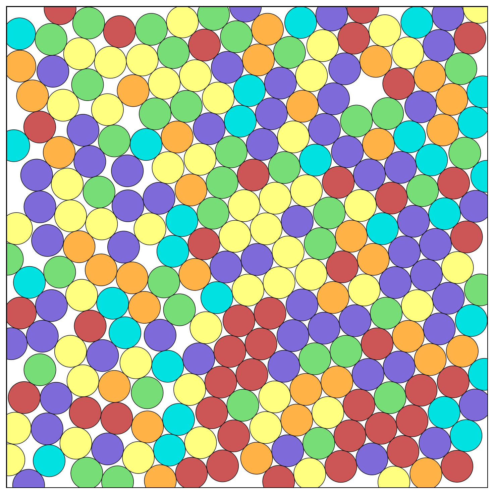
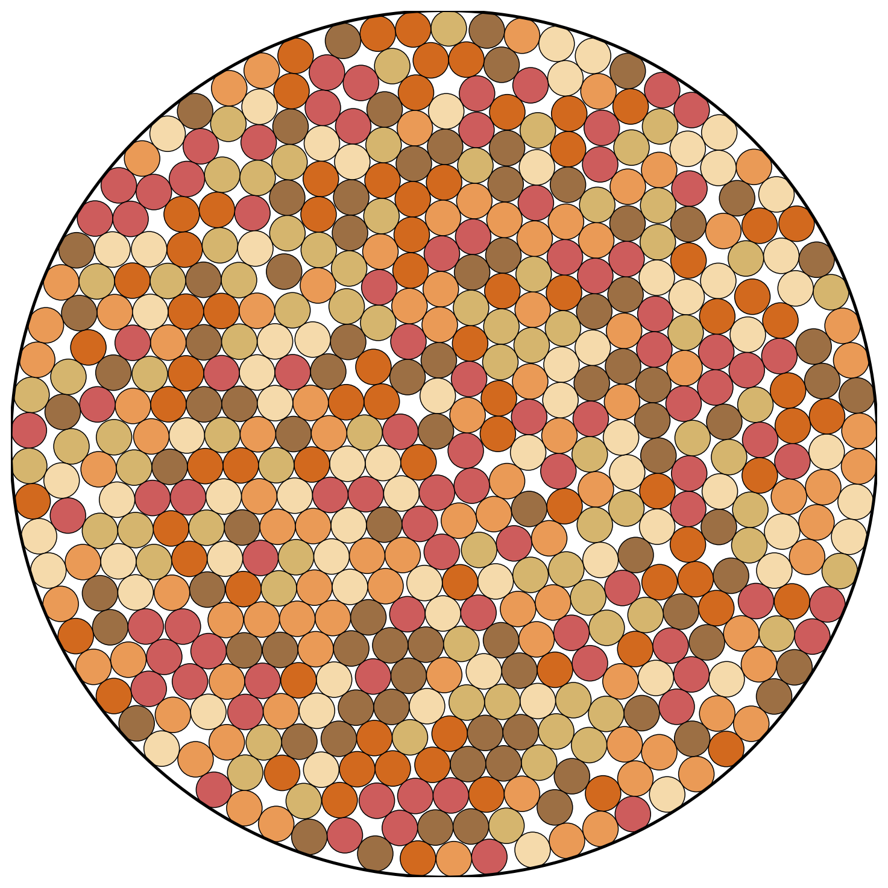
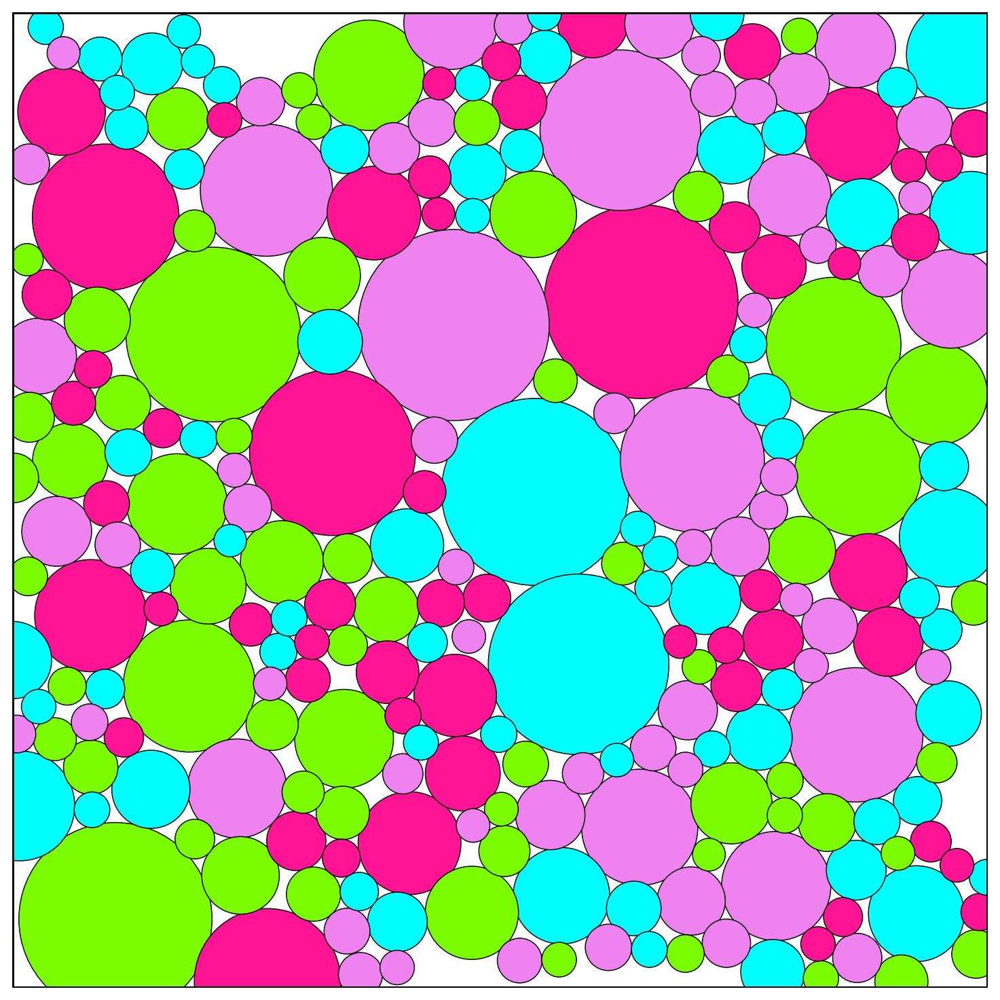
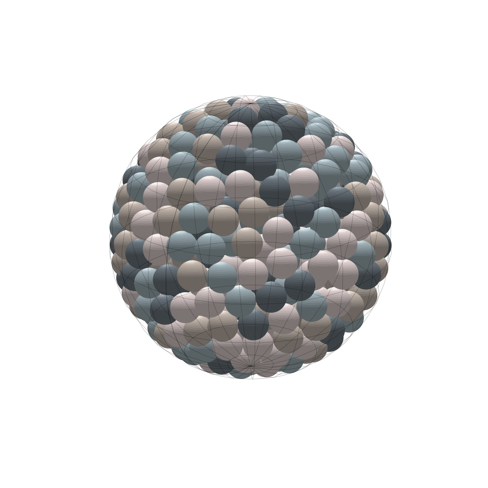

# RCPGenerator Python

**RCPGenerator** provides a Python interface for random close packing and hypersphere packing based on the validated legacy C++ implementation contained in this repository. It is intended for users who want Python-based particle packing workflows, including sphere packing in boxes, particle packing in curved containers, staged target packing-fraction workflows, and inline visualization from notebooks or Google Colab.

The Python interface was generated through a large-scale refactoring of the original C++ code using **OpenAI Codex (GPT-5.4)**. Codex produced the Python bindings, CMake build system, high-level Python API, and example workflows, including the `getting_started.ipynb` notebook and much of this README. While the underlying packing engine is the original validated C++ implementation, the Python interface and surrounding tooling were automatically constructed from it. Minor rough edges may remain, and users interested in the algorithmic details should consult the README in the repository root for a conceptual description of the algorithm. This README focuses primarily on the Python interface, features, and exposed parameters.

If you are searching for:

- Python particle packing  
- Python random close packing  
- Python sphere packing  
- Python code to pack particles in a box  
- Python code to pack spheres in a box  
- hypersphere packing in Python  

this package provides a Python entry point for those workflows.

---

# Overview

The `python/` package wraps the validated C++ packing engine with:

- a thin **pybind11 binding layer**
- a stateful pure-Python `rcpgenerator.Packing` API
- rendering utilities for **2D and 3D packings**
- optional **trajectory capture and animation**
- example scripts covering boxes, curved containers, multiple particle distributions, and staged target packing-fraction workflows

The primary user-facing API is: rcpgenerator.Packing

## Features

- Python-first packing workflow through `rcpgenerator.Packing`
- Random close packing style evolution with legacy-faithful defaults
- 2D and 3D examples out of the box
- Flat and curved container support:
  - box
  - circle
  - cylinder
  - sphere
- Built-in particle size distributions:
  - monodisperse
  - bidisperse
  - lognormal
  - flat
  - powerlaw
  - custom
- Staged target packing fraction workflows with `relax(...)` and `update_phi(...)`
- Python rendering for saved figures and notebook display
- Optional trajectory capture and 2D GIF animation

## Installation

Clone the repository and install from the `python/` package directory:

```bash
git clone https://github.com/KD-physics/RCPGenerator.git
cd RCPGenerator/python_code/python
pip install .
```

After installation:

```python
import rcpgenerator
print(rcpgenerator.Packing)
```

## Quick Start

```python
import rcpgenerator

packing = rcpgenerator.Packing(
    phi=0.11,
    N=250,
    Ndim=2,
    box=[1.0, 1.0],
    walls=[0, 0],
    fix_height=False,
    dist={"type": "mono", "d": 1.0},
    neighbor_max=0,
    seed=123,
)

packing.pack()
packing.show_packing(palette_choice=1)
packing.savefig("packing.png", palette_choice=1)

print(packing.summary())
print("final phi:", packing.phi_final)
print("steps:", packing.steps)
print("force magnitude:", packing.force_magnitude)
```

## Main Packing API

`rcpgenerator.Packing` is the main public interface. It is a pure-Python stateful wrapper around the validated dict-based binding layer.

Construction initializes particle positions immediately:

```python
import rcpgenerator

p = rcpgenerator.Packing(
    phi=0.11,
    N=250,
    Ndim=2,
    box=[1.0, 1.0],
    walls=[0, 0],
    fix_height=False,
    dist={"type": "mono", "d": 1.0},
    neighbor_max=0,
    seed=123,
)
```

### Public methods

- `Packing(...)`
- `initialize()`
- `pack(verbose=None, progress_interval=1000, capture_trajectory=False, trajectory_interval=1000)`
- `relax(n_steps, mu=None, fix_diameter=False, target_phi=None, verbose=False, progress_interval=1000, capture_trajectory=False, trajectory_interval=1000)`
- `render(path=None, show=False, palette_choice=1)`
- `savefig(path, show=False, palette_choice=1)`
- `show_packing(palette_choice=1)`
- `animate_2d(path=None, show=True, palette_choice=1, interval_ms=80, repeat=False)`
- `summary()`
- `reset()`
- `update_phi(target_phi)`
- `update_box(box)`
- `update_height(height)`
- `copy()`
- `clone()`
- `to_dict()`
- `Packing.from_dict(data)`

### Important attributes

- Initialization config:
  - `phi`
  - `N`
  - `Ndim`
  - `box`
  - `walls`
  - `fix_height`
  - `dist`
- Packing config:
  - `neighbor_max`
  - `seed`
- Realized state:
  - `positions`
  - `diameters`
- Final results:
  - `steps`
  - `phi_final`
  - `max_min_dist`
  - `force_magnitude`
  - `phi_history`
  - `force_history`
  - `energy_history`
- Status flags:
  - `initialized`
  - `packed`
  - `needs_initialize`
  - `needs_pack`
- Optional recorded trajectory:
  - `trajectory_positions`
  - `trajectory_diameters`
  - `trajectory_steps`
  - `trajectory_phi`
  - `trajectory_force`
  - `trajectory_energy`
  - `trajectory_max_min_dist`

### Stateful behavior

- Construction initializes immediately.
- Changing initialization-related attributes marks the object as needing reinitialization.
- Changing packing-related or realized-state attributes marks the object as needing packing again.
- `pack()` reinitializes only when needed.
- `reset()` keeps configuration but clears realized state and results.
- `copy()` and `clone()` return independent copies.
- `Packing.from_dict(p.to_dict())` reconstructs the current wrapper state.

## Important Controls

The table below covers the most important user-facing controls in the current package.

| Control | Where | Meaning |
| --- | --- | --- |
| `phi` | constructor | Initial packing fraction used for initialization |
| `N` | constructor | Number of particles |
| `Ndim` | constructor | Dimension of the packing space |
| `box` | constructor / state | Box or container size parameters |
| `walls` | constructor / state | Boundary convention for periodic, flat-wall, or curved containers |
| `fix_height` | constructor / state | Use fixed-height semantics for the last dimension |
| `dist` | constructor | Particle diameter distribution definition |
| `neighbor_max` | constructor | Neighbor list allocation hint; `0` uses legacy defaults |
| `seed` | constructor | Seed field carried through the current API |
| `verbose` | constructor / `pack` / `relax` | Print coarse progress and status |
| `progress_interval` | `pack` / `relax` | Sampling interval for printed progress |
| `capture_trajectory` | `pack` / `relax` | Record sampled packing evolution |
| `trajectory_interval` | `pack` / `relax` | Sampling interval for recorded trajectory snapshots |
| `n_steps` | `relax` | Hard upper bound for the relaxation run |
| `mu` | `relax` | Advanced override of the core diameter-growth coupling |
| `fix_diameter` | `relax` | Explicitly freeze diameter evolution during relaxation |
| `target_phi` | `relax` | Grow toward a target packing fraction, then lock diameters and continue relaxing |
| `target_phi` | `update_phi` argument | Deterministically rescale the realized state to a requested packing fraction |
| `palette_choice` | rendering methods | Select one of the built-in MATLAB-derived color palettes |

## Advanced Controls

The standard workflow is:

```python
p.pack()
```

For more control over the current realized state, use `relax(...)`:

```python
p.relax(
    n_steps=5000,
    mu=None,
    fix_diameter=False,
    target_phi=0.82,
    verbose=True,
    progress_interval=1000,
)
```

Current advanced controls:

- `mu`
  - advanced override for the core diameter-growth coupling during that `relax()` call
- `fix_diameter`
  - freezes diameter evolution explicitly
  - this is a real fixed-diameter mode, not just `mu=0`
- `n_steps`
  - hard upper bound for the run
  - the existing stopping criteria can still terminate earlier
- `target_phi`
  - gradually evolves toward a requested packing fraction
  - once reached, diameters are adjusted to the target phi, then locked for the remainder of that call

### Realized-state editing helpers

These methods operate on the current realized state and are useful for staged workflows:

```python
p.update_phi(0.88)
p.relax(n_steps=1000, fix_diameter=True)

p.update_box([1.1, 0.9])
p.update_height(0.85)
```

- `update_phi(target_phi)`
  - rescales diameters to hit the requested packing fraction
  - respects current `fix_height` semantics
- `update_box(box)`
  - updates the realized box, rescales positions, and rescales diameters consistently
- `update_height(height)`
  - convenience helper for changing the last box dimension

## Examples

The package ships with real example scripts under [examples](./examples/). These are the best starting point because they exercise the current public API exactly as implemented.

Included examples:

- [examples/minimal.py](./examples/minimal.py)
- [examples/starter.py](./examples/starter.py)
- [examples/example_2d_bidisperse_box.py](./examples/example_2d_bidisperse_box.py)
- [examples/example_2d_circular_container.py](./examples/example_2d_circular_container.py)
- [examples/example_2d_polydisperse_box.py](./examples/example_2d_polydisperse_box.py)
- [examples/example_2d_powerlaw_phi_staging.py](./examples/example_2d_powerlaw_phi_staging.py)
- [examples/example_3d_monodisperse_box.py](./examples/example_3d_monodisperse_box.py)
- [examples/example_3d_bidisperse_box.py](./examples/example_3d_bidisperse_box.py)
- [examples/example_3d_cylindrical_container.py](./examples/example_3d_cylindrical_container.py)
- [examples/example_3d_spherical_container.py](./examples/example_3d_spherical_container.py)
- [getting_started.ipynb](./getting_started.ipynb) for Google Colab / notebook use

Run an example from `python/`:

```bash
python examples/minimal.py
python examples/run_all_examples.py
```

## Example Output

2D monodisperse box:



2D circular container:



2D staged power-law packing:



3D spherical container:



These images are produced by the current example suite and use the real rendering pipeline in the package.

## Visualization / Animation

The package includes Python-side rendering utilities built on top of `matplotlib`.

### Inline display

```python
p.show_packing(palette_choice=4)
```

This is the simplest way to display a packing inline in notebooks or Google Colab.

### Save a figure

```python
p.savefig("packing.png", palette_choice=4)
```

### Record trajectory and animate in 2D

```python
import rcpgenerator

p = rcpgenerator.Packing(
    phi=0.11,
    N=64,
    Ndim=2,
    box=[1.0, 1.0],
    walls=[0, 0],
    fix_height=False,
    dist={"type": "mono", "d": 1.0},
    neighbor_max=0,
    seed=123,
)

p.pack(
    verbose=True,
    progress_interval=1000,
    capture_trajectory=True,
    trajectory_interval=500,
)

p.animate_2d(path="packing.gif", show=False, palette_choice=3)
```

Notes:
- `animate_2d(...)` requires a previously recorded 2D trajectory.
- GIF output is supported in the current implementation.
- Rendering and animation are Python-side utilities; they do not change the packing results.

## Containers and Distributions

### Supported geometries

Current examples cover these geometries:

- Box
  - periodic box examples in 2D and 3D
- Circle
  - 2D curved container via the legacy wall convention
- Cylinder
  - 3D curved container via the legacy wall convention
- Sphere
  - 3D curved container via the legacy wall convention

Typical `walls` values used in the shipped examples:

| Geometry | `Ndim` | Example `walls` |
| --- | --- | --- |
| Periodic box | 2 or 3 | `[0, 0]`, `[0, 0, 0]` |
| Circle | 2 | `[-2, 0]` |
| Cylinder | 3 | `[-2, 0, 0]` |
| Sphere | 3 | `[-3, 0, 0]` |

### Built-in distributions

Supported distribution types in the current initializer:

| `dist["type"]` | Parameters |
| --- | --- |
| `mono` | `d` |
| `bidisperse` | `d1`, `d2`, `p` |
| `lognormal` | `mu`, `sigma` |
| `flat` | `d_min`, `d_max` |
| `powerlaw` | `d_min`, `d_max`, `exponent` |
| `custom` | `custom` list with `N` entries |

Examples in this repo use:
- monodisperse box and curved-container packings
- bidisperse 2D and 3D boxes
- lognormal 2D polydisperse packing
- powerlaw staged target-phi packing

## Target Packing Fraction / Relaxation

One of the most useful advanced workflows in the current package is staged target packing fraction control.

### Grow to a target, then lock and relax

```python
p.relax(n_steps=5000, target_phi=0.82)
```

This uses the current advanced relax path:
- the system evolves toward the target packing fraction
- once the target is reached, diameters are adjusted to match the target phi
- diameter evolution is then locked for the remainder of that call

### Step beyond RCP-like states with fixed-diameter relaxation

The staged example [examples/example_2d_powerlaw_phi_staging.py](./examples/example_2d_powerlaw_phi_staging.py) demonstrates:

```python
p.relax(n_steps=5000, target_phi=0.82)
for target_phi in [0.84, 0.86, 0.88, 0.90, 0.92, 0.94]:
    p.update_phi(target_phi)
    p.relax(n_steps=1000, fix_diameter=True)
```

That workflow is useful when you want the stable growth behavior up to a threshold, then controlled fixed-diameter relaxation at increasingly dense target states.

## Thin Binding API

The lower-level dict-based functions remain available for advanced usage:

```python
import rcpgenerator

state = rcpgenerator.initialize_particles({
    "phi": 0.11,
    "N": 4,
    "Ndim": 2,
    "box": [1.0, 1.0],
    "walls": [0, 0],
    "fix_height": False,
    "dist": {"type": "mono", "d": 1.0},
})

result = rcpgenerator.run_packing(
    {
        "positions": state["positions"],
        "diameters": state["diameters"],
    },
    {
        "box": state["box"],
        "walls": state["walls"],
        "neighbor_max": 0,
        "seed": 123,
        "fix_height": False,
    },
)
```

This lower-level API is useful if you want a thin dict-based interface without the stateful wrapper, but most users should start with `rcpgenerator.Packing`.

## Scientific Background

RCPGenerator is built around a legacy random close packing code path that has been preserved as closely as practical while making it accessible from Python. The intent is not to redesign the algorithm, but to expose the same core workflow through:

- reusable C++ library code
- Python bindings
- a user-friendly Python object interface
- plotting, rendering, and notebook examples

The project is relevant for users working on:
- random close packing
- sphere packing in a box
- particle packing in Python
- curved-container packing
- higher-dimensional hypersphere packing studies

## Search-Friendly Summary

If you need Python code for packing particles in a box, Python code for packing spheres in a box, a Python random close packing workflow, or a hypersphere packing Python interface built on a validated C++ core, the package in this `python/` directory is the intended entry point.

